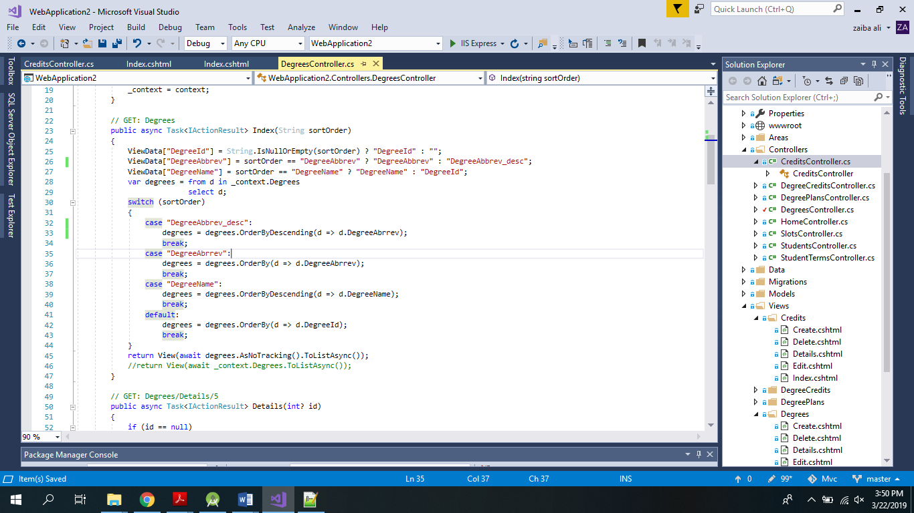
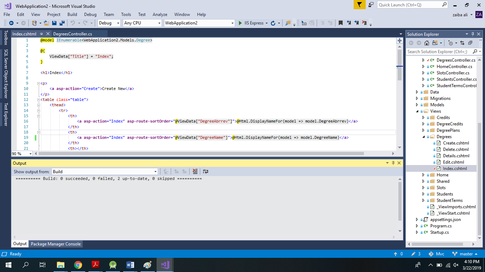
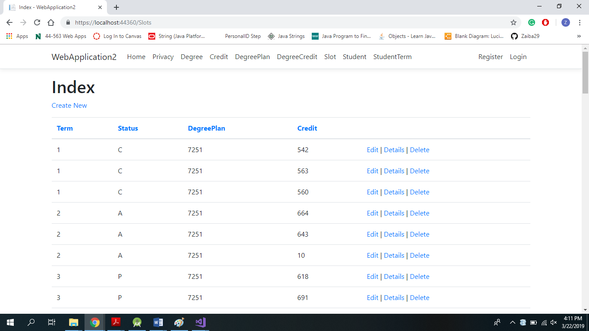
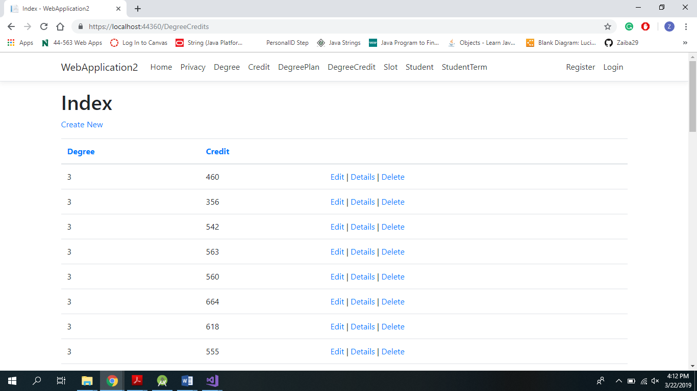

# Project Title

Designing with Data.

## Group Members - Developers

* Vamshi Krishna Nuka
* Zaiba Ali
* Harshitha Chetty Ragava

## Getting Started

The App mainly focuses on developing a MVC for an University Degree Plan which includes terms, credits, Courses, slots etc.,.

## Cloning 
On GitHub, navigate to the main page of the repository, under the repository name, click Clone or download in local machine.

## Initialize
Open Git Bash.
Change the current working directory to your local project.
Initialize the local directory as a Git repository.
$ git init

## Run app locally
Click the clone from the repository and come to local repo and click .gitclone Open the the app in Visual Studio and run it.

## Deploying the app
Please reffer the folloeing link.

https://docs.microsoft.com/en-us/azure/devops/pipelines/targets/webapp?view=azure-devops&tabs=yaml

## Issues Tracking
https://github.com/HarshithaChettyRagava/Mvc/issues

## Screen shots

## Software 
* C#.NET 
* GITHUB
* TortiseGIT

## Deployment
- GitHub Pages.

## Link
Github - [https://github.com/HarshithaChettyRagava/Mvc]

